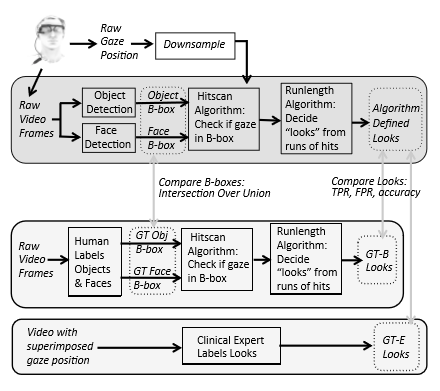
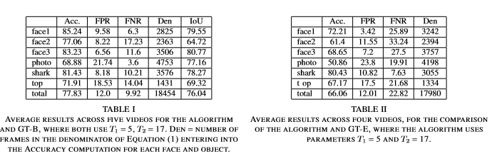
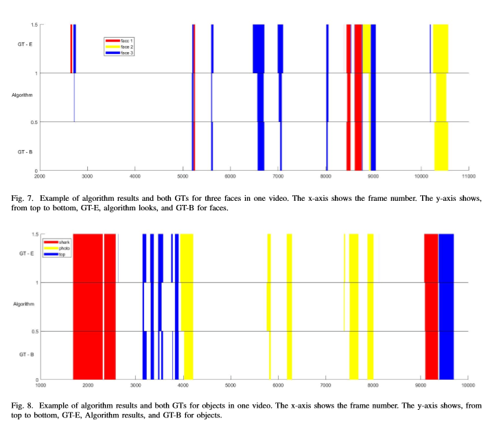

# Gaze-Glasses

## Background
As technologies develop for acquiring gaze behavior in real world social settings, robust methods are needed that minimize the time required for a trained observer to code behaviors. We record gaze behavior from asubjectwearingeye-trackingglassesduringanaturalistic interaction with three other people, with multiple objects that are referred to or manipulated during the interaction. The resulting gaze-in-world video from each interaction can be manually coded for different behaviors, but this processrequirestrainedbehavioralcodersandisextremely time-consuming. Instead, we use a neural network to detect objects, and a Viola-Jones framework with feature tracking to detect faces. The time sequence of events when the gaze lands within the object/face bounding boxes is processed for run lengths to determine “looks”, and we discuss optimization of run length parameters. The performance of the algorithm is compared against a bounding box ground truth and an expert holistic ground truth

## System Overview
presents an overview of the system operation and the formation of the different types of ground truth (GT). The Pupil Labs eye-tracking glasses (Pupil Pro) produce raw video frames (24-bit color, 720 × 1280, 60Hz) from the world-view camera and raw gaze position data at 120Hz from the eye camera. The gaze data is downsampledtothevideoframerate.World-viewframes are input separately to object and face detection modules, whose outputs are sets of bounding boxes, intended to bound faces and objects within the chosen set of objects. Next, the hitscan algorithm inputs a bounding box and gaze position, and puts out a binary result of whether the gaze position is inside the bounding box (a “hit”). The runlength algorithm processes these binary values to determine the presence and duration of a “look” to an object or face; a minimum runlength of hits is required to declare a look, and a gap in the hits above another threshold value determines the end of that look.

The lighter gray rectangles in Figure 1 depict the formation of the two GTs for looks. In one approach, humans mark bounding boxes for each object/face in each frame, without gaze position shown. These boxes and the gaze position are then passed through the hitscan and runlength algorithms to determine looks, referred to as GT-B looks. In the second approach (GT-E looks), an expert clinical neuroscientist directly labels looks by reviewing the video with superimposed gaze position in a holistic way that would be used in clinical practice. In the figure, the three vertical gray arrows show points at whichthealgorithmperformanceisevaluated.Algorithm bounding boxes are compared against the boxes marked by humans, and algorithm-defined looks are compared against GT-B and GT-E Looks.

## Result
For a given face or object (e.g, the shark) we first evaluate bounding boxes. We compute for each frame the area of intersection divided by the area of union (IoU) of the algorithmic and manual bounding boxes for that object. The IoU values are averaged over frames, and over five videos, and reported in the last column of Table I. We next evaluate the algorithm at the level of frames within looks. A sample of the results for faces in one video appears in Figure 7, and a sample of results for objects is in Figure 8. Frame i represents a true positive event for a look to face 1 if frame i is part of a look to that face according to GT and frame i is also part of a look to that face in the algorithm output. Recall that for frame i to be part of a look to a face does not require that the gaze is within the face bounding box for frame i, or even that the face was detected in that frame. If the face was detected and the gaze was inside its bounding box for earlier and later frames, and frame i is part of a sufficiently short gap, then frame i can still be considered part of the look. The following provides an example. The first row is the binary sequence of hits for algorithm bounding boxes, that is, a value of 1 represents a case where the gaze position is inside the algorithm-derived bounding box: row 1: 0001111110011110000000000000000001111111 Although in this sequence, frames 10 and 11 do not have the gaze inside the bounding box, the runlength algorithm considers that two frames is too short to be interpreted as looking away. So those frames are considered part of the look, and the frame-level algorithm output for looks is as follows: row 2: 0001111111111110000000000000000001111111 So performance measures, such as true positive events, are counted between this sequence for the algorithm and GT-E (or between the algorithm and the corresponding runlength-processed bounding box ground truth GT-B). Let TP represent the total number of true positive events for that video and that object. A false positive event (for a given object) occurs when frame i is not part of a look to that object according to GT but is part of a look to that object for the algorithm. FP denotes the number of falsepositiveevents.Similarly FN isthenumberoffalse negative events, when a frame is part of a look according to GT but the algorithm does not mark it. Lastly TN represents the number of true negative events, where neither the GT nor the algorithm considers a look to be occurring in a given frame. False Positive Rate and False Negative Rate are defined as FPR = FP/(FP + TP) and FNR = FN/(TP +FN). One standard definition of accuracy is A = (TP+TN)/(TP+FP+TN+FN) however since the subject is often not looking at any of the objects or faces under consideration, TN is large, and including it in both the numerator and denominator would obscure the trends. Instead we use the definition A = TP/(TP + FP + FN) 
The values for accuracy, FPR, and FNR for each object/face, averaged across videos, are in Table 1 (relative to GT-B) and in Table 2 (relative to GT-E).

